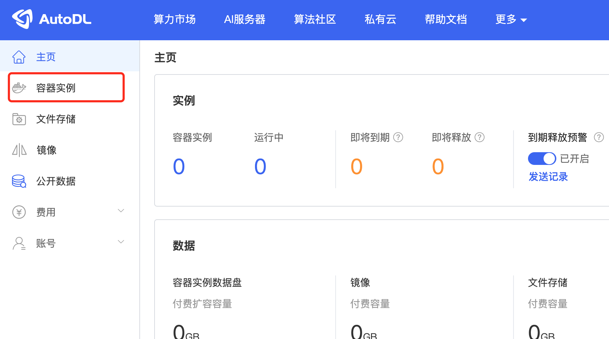
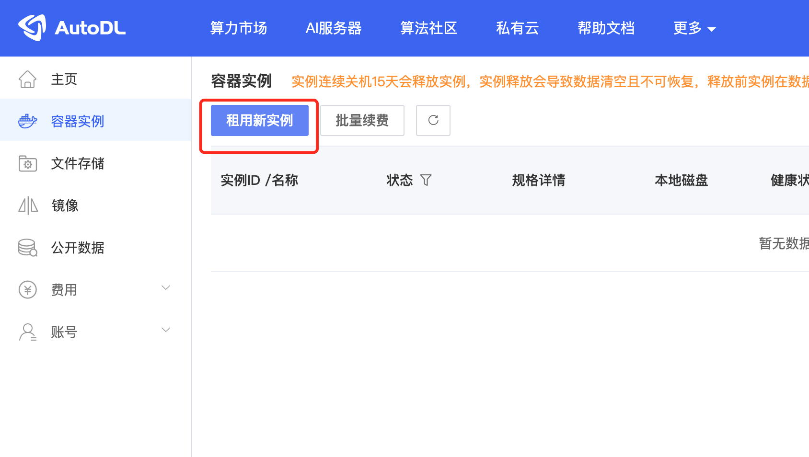
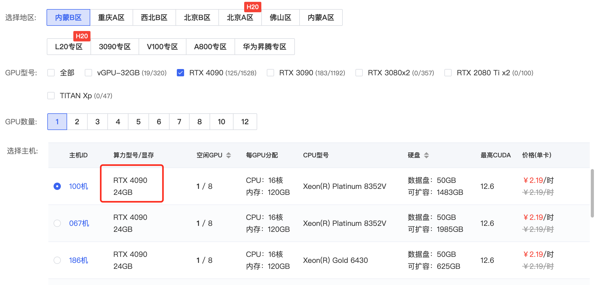
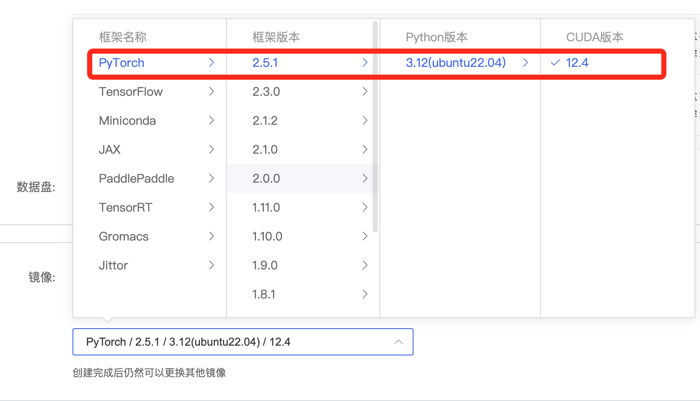
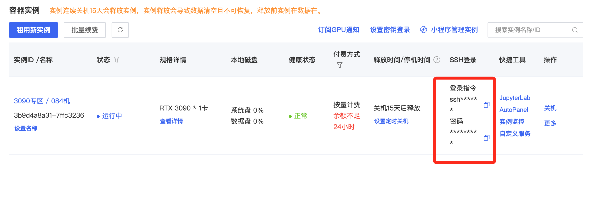
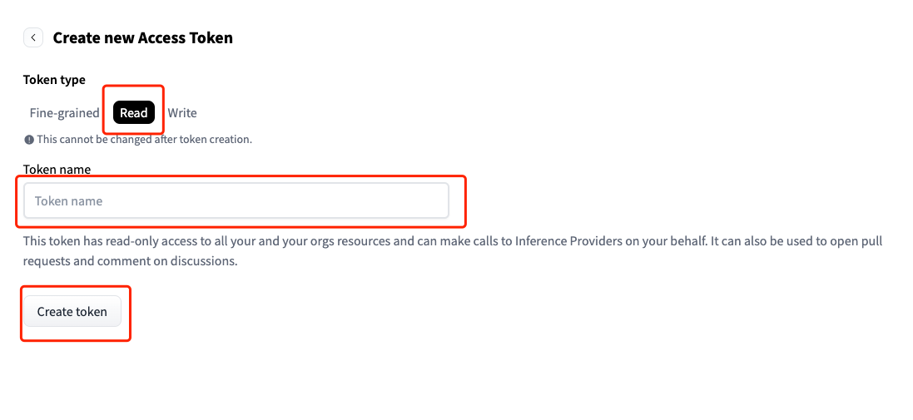
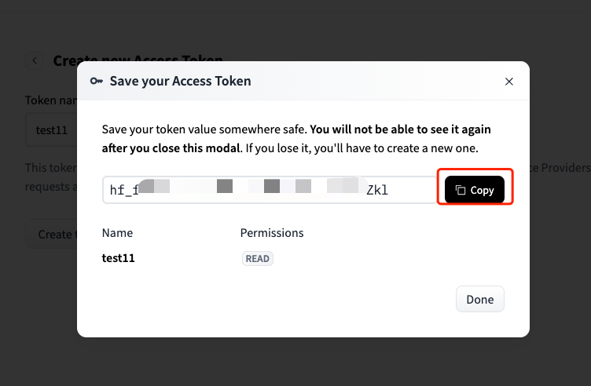
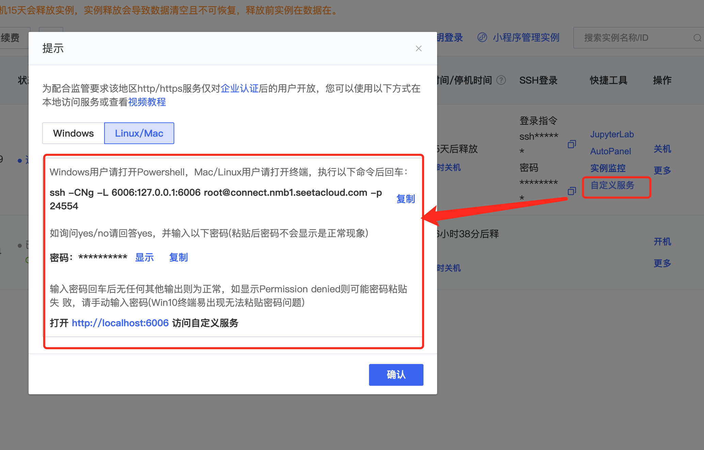
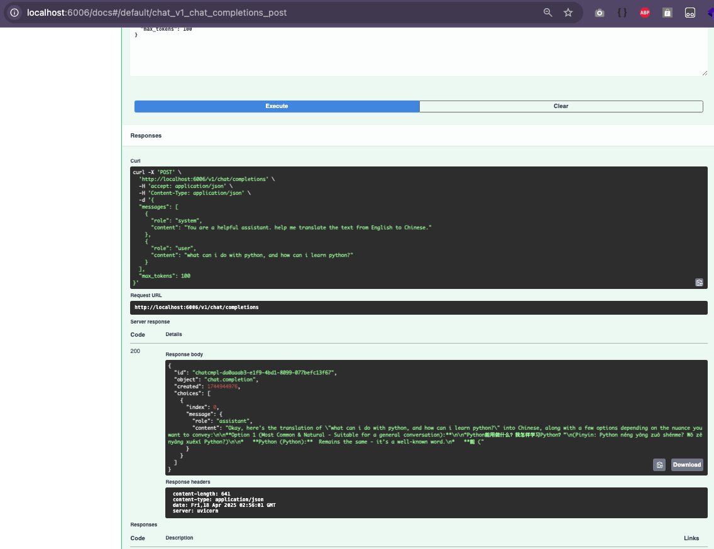
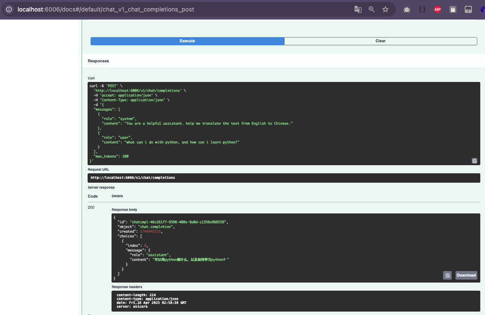

## 服务器初始化步骤

## 浏览器打开 [Autodl](https://www.autodl.com/)






选择 4080 






登录服务器



## 网络加速
```shell
# https://www.autodl.com/docs/network_turbo/
source /etc/network_turbo

# 取消加速
# unset http_proxy && unset https_proxy

```

## 拉取代码
```shell
git clone git@github.com:rockj2016/gemma-finetune.git
cd gemma-finetune
```

## 初始化变量 

 获取你的huggingface token https://huggingface.co/settings/tokens
 *需要勾选read 权限



```shell
# 初始化环境变量
cp .env-example .env
# 编辑.env 使用你的 HF_TOKEN替换
vim .env 

```


## 安装依赖
```shell
pip install -r requirements.txt
```

## 拉取 Gemma-3-4b-it 模型
```shell
python download_model.py
```

## 运行 fastapi 后端 测试 Gemma-3-4b-it 模型
```shell
python api.py
```

## 开启autodl隧道


## 本地浏览器访问 http://localhost:6006/docs 测试大模型




## 微调模型
```
# control + c 终止 api.py 服务
python finetune.py
```

## 测试微调效果
```
python api.py -mode ft
```

## 本地浏览器访问 http://localhost:6006/docs 测试微调过的模型

