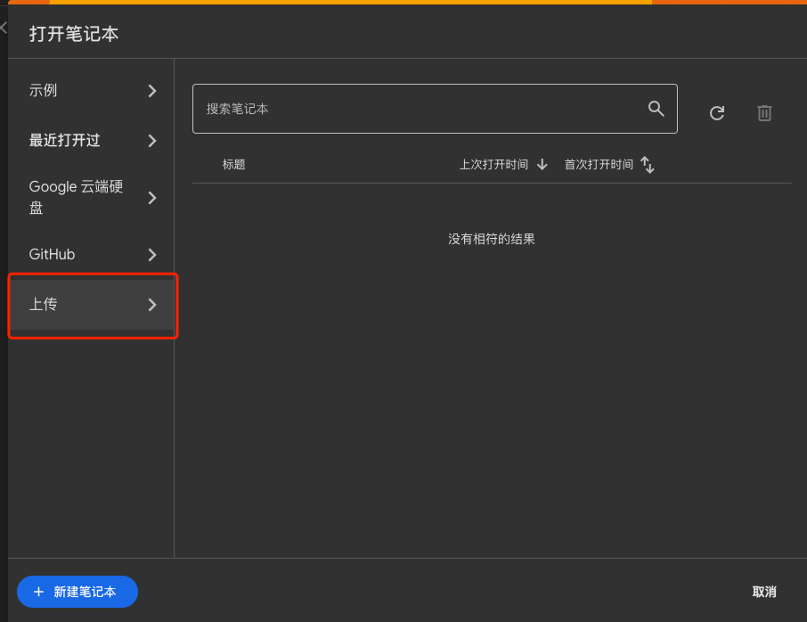
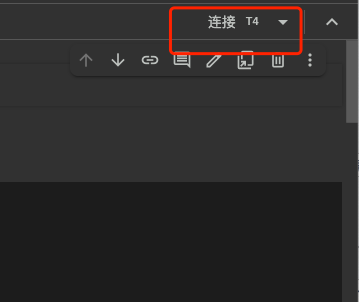
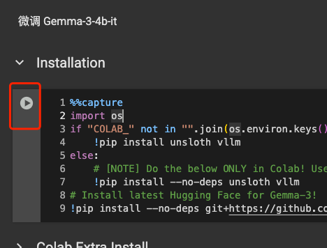

## 浏览器打开 [colab](https://colab.research.google.com/)

## 上传 代码仓库中 colab/ft-gemma.ipynb 文件

## 点击右上角连接

## 获取你的huggingface token 
 https://huggingface.co/settings/tokens
 *需要勾选read 权限

## 依照顺序点击每个代码块的运行按钮
   

